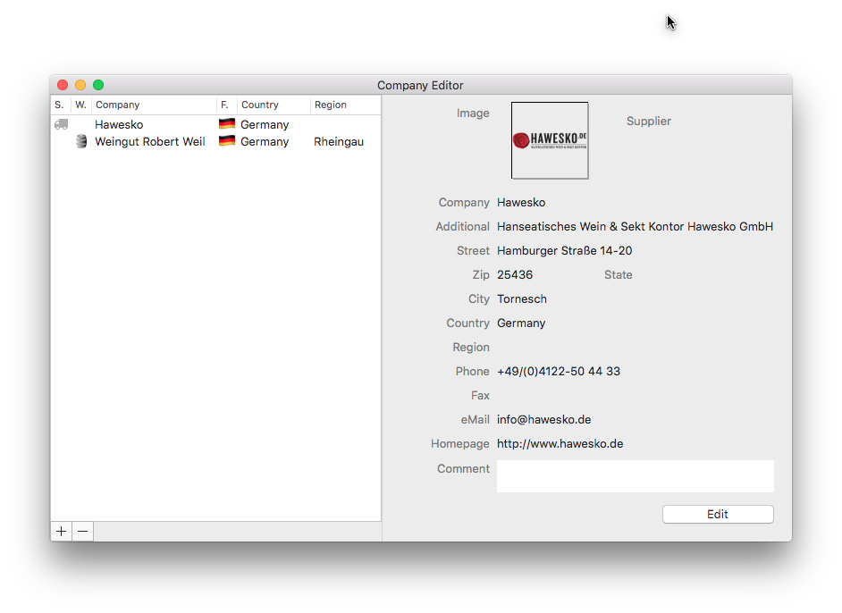

## Addresses

The address book is the right place to gather all your wine supplier and winery contacts in order to maintain their details and special information.
A wine supplier is indicated by  and a wine maker by .

### Add a new address

1. Click the Toolbar button  , the menu „Tools > Open Company Editor“ or the hotkey „Option (⌥)-Command (⌘)-A“
2. Click on the „+“  button below the list.
3. Fill out the appropriate fields
4. Then click on the „Done“ button.

### Change a address

1. Once you have found the desired list entry, tap the entry in order to select it. 
2. You can change the displayed information for any existing record by overwriting the appropriate fields.
3. After you complete the desired entries confirm your entries by clicking on the „OK“ button, or click on the „Cancel“ button to discard them.